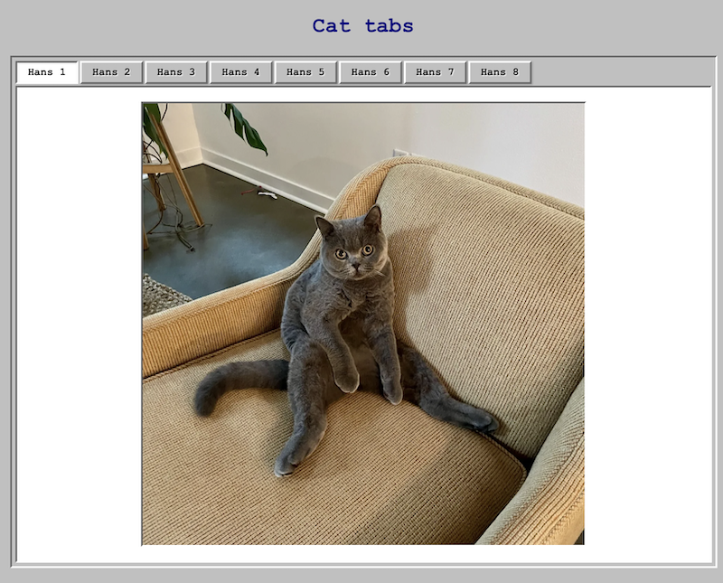

# Tabs Component - Accessible React Component

[](https://opensource.org/licenses/MIT)
[](https://nodejs.org/)
[](https://reactjs.org/)
[](https://www.typescriptlang.org/)
[](https://vitejs.dev/)
[](https://vitest.dev/)

A fully accessible, ARIA-compliant Tabs component with 90s style and a cat, built with React, TypeScript, and styled-components.



https://tyreer.github.io/cat-tabs/

## 🛠️ Getting Started

### Prerequisites

- Node.js (version 18 or higher)
- npm or yarn

### Installation

1. **Clone the repository:**

   ```bash
   git clone https://github.com/tyreer/cat-tabs.git
   ```

2. **Install dependencies:**

   ```bash
   npm install
   ```

3. **Start development server:**

   ```bash
   npm run dev
   ```

4. **Run tests:**

   ```bash
   npm test
   ```

5. **Build for production:**
   ```bash
   npm run build
   ```

## ✨ Features

### 🎯 Core Functionality

- **Full ARIA Compliance** - Follows [W3C ARIA Tabs pattern guidelines](https://www.w3.org/WAI/ARIA/apg/patterns/tabs/)
- **Keyboard Navigation** - Arrow keys, Tab key, and focus management
- **Automatic Activation** - Tabs activate when focused
- **Controlled/Uncontrolled** - Supports both component patterns
- **Error Handling** - Comprehensive validation with user-friendly messages

### ♿ Accessibility Features

- **Screen Reader Support** - Full compatibility with assistive technologies
- **Keyboard Navigation** - Complete keyboard accessibility
- **Focus Management** - Proper focus indicators and movement

### 🧪 Testing & Quality

- **User Interaction Testing** - Comprehensive user behavior testing following [Testing Library query priority guidelines](https://testing-library.com/docs/queries/about#priority)
- **Accessibility Testing** - ARIA and screen reader testing
- **Edge Case Testing** - Error handling and validation testing

### Dependencies

- `react` & `react-dom` - React framework
- `styled-components` - CSS-in-JS styling
- `@types/styled-components` - TypeScript definitions

## 📁 Project Structure

```
src/
├── components/          # Tabs component implementation
│   ├── Tabs.tsx         # Main Tabs component with sub-components
│   ├── Tabs.test.tsx    # Comprehensive test suite (36 tests)
│   └── index.ts         # Component exports
├── test/               # Test configuration
│   └── setup.ts        # Test setup file
├── public/             # Static assets
│   └── cat/            # Demo cat images (8 images)
├── llm-spec/           # Project documentation
│   └── todo.md         # Implementation checklist
├── App.tsx             # Demo application with Hans cat gallery
├── main.tsx            # Application entry point
├── index.css           # Global styles
└── vite-env.d.ts       # Vite type definitions
```

## 🎨 Usage Examples

### Basic Usage

```tsx
import { Tabs } from './components';

const tabs = [
  {
    id: 'tab1',
    label: 'First Tab',
    content: <div>Content for first tab</div>,
  },
  {
    id: 'tab2',
    label: 'Second Tab',
    content: <div>Content for second tab</div>,
  },
];

function App() {
  return <Tabs tabs={tabs} aria-label="Main navigation" />;
}
```

### Controlled Mode

```tsx
import { useState } from 'react';

import { Tabs } from './components';

function App() {
  const [activeTabId, setActiveTabId] = useState('tab1');

  const handleTabChange = (activeTab) => {
    setActiveTabId(activeTab.id);
  };

  return (
    <Tabs
      tabs={tabs}
      activeTabId={activeTabId}
      onTabChange={handleTabChange}
      aria-label="Controlled tabs"
    />
  );
}
```

## 🧪 Testing

The project includes comprehensive testing with **36/36 tests passing**:

- **Vitest** - Fast test runner with Jest-compatible API
- **React Testing Library** - User-focused testing utilities

- ✅ **User Interaction Tests** - Click, keyboard, and focus navigation
- ✅ **Accessibility Tests** - ARIA attributes and screen reader compatibility
- ✅ **Edge Case Tests** - Empty arrays, invalid objects, error handling
- ✅ **Integration Tests** - Controlled/uncontrolled modes, callbacks
- ✅ **Performance Tests** - Component memoization and event handlers

### Running Tests

```bash
# Run all tests
npm test

# Run tests once
npm run test:run

# Run tests with UI
npm run test:ui

# Run tests without type checking
npm run test:only
```

**Local Development:**

```bash
npm run dev
# Visit http://localhost:5175/
```

## 📝 Available Scripts

- `npm run dev` - Start development server
- `npm run build` - Build for production
- `npm run preview` - Preview production build
- `npm test` - Run tests with type checking
- `npm run test:run` - Run tests once with type checking
- `npm run test:ui` - Run tests with UI
- `npm run test:only` - Run tests without type checking
- `npm run lint` - Run ESLint
- `npm run format` - Format code with Prettier
- `npm run format:check` - Check code formatting

## 🔧 Configuration Files

- `vite.config.ts` - Vite configuration with Vitest setup
- `tsconfig.json` - TypeScript configuration
- `vitest.config.ts` - Vitest testing configuration
- `.gitignore` - Comprehensive git ignore rules

## 📚 References

This implementation follows established best practices and guidelines:

- **[W3C ARIA Authoring Practices Guide - Tabs Pattern](https://www.w3.org/WAI/ARIA/apg/patterns/tabs/)** - Official accessibility guidelines for tab interfaces
- **[Testing Library Query Priority Guidelines](https://testing-library.com/docs/queries/about#priority)** - Best practices for semantic testing queries
- **[[Margin considered harmful]](https://mxstbr.com/thoughts/margin)** - Guidelines for spacing and layout via Max Stoiber

These resources informed our implementation decisions for accessibility, testing, and styling approaches.
